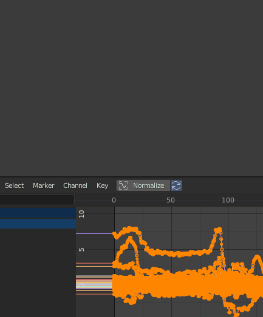

# blender_addon_smooth_animation
smooth animation curve using low pass filter
# How to use 
1. install scipy  
   cd blender install path, find python,run  
   ...\2.80\python\bin> python.exe -m pip install scipy
2. install smooth animtion.py
3. how to use  
   